# Training with Tesseract and Tesstrain

## 1. Requirements
In addition to the required software (Python, Tesseract and Tesstrain), an active **GitHub account** (https://github.com) and basic user knowledge of this service are required. The training itself does not have high system requirements apart from some memory requirements: any office PC should be able to complete the training.

The training workflow for Tesseract is carried out via the command line.

### 1.1 Required software
* Python >= 3.6
* Tesseract > 4.1.x / 5.x.x **with training tools**
* Tesstrain

### 1.2 Installation of required software

#### 1.2.1 Python >= 3.6
Depending on the operating system, the installation of Python >= 3.6 may vary. A helpful guide can be found on [Real Python](https://realpython.com/installing-python/).

#### 1.2.2 Tesseract 5.x.x with trainings tools
[Installation guide for Tesseract *with* training tools](https://github.com/tesseract-ocr/tessdoc/blob/main/Compiling-%E2%80%93-GitInstallation.md#build-with-training-tools).

#### 1.2.3 Tesstrain

1. Clone [Tesstrain](https://github.com/tesseract-ocr/tesstrain) from Github via the command line:

```
git clone https://github.com/tesseract-ocr/tesstrain.git

# or via SSH

git clone git@github.com:tesseract-ocr/tesstrain.git
```

2. Change to the Tesstrain folder:

```
cd tesstrain
```

3. Install packages relevant for Tesstrain:

```
pip install -r requirements.txt

# or 

python3 -m pip -r requirements.txt
```

## 2. Tesseract model training with Tesstrain
1. Tesstrain provides a training workflow for Tesseract that can train new Tesseract models with the help of provided ground truth. It is also possible to fine-tune (retrain) an existing Tesseract model with Tesstrain. (see point 2.2.)
2. Tesseract training with Tesstrain is carried out via the command line.
3. Two basic training modes can be distinguished:

* Training from scratch (training of a new model): A *training from scratch* creates **a new Tesseract model** based on the ground truth provided
* Fine-tuning / retraining: The fine-tuning or retraining of an *existing* Tesseract model is carried out with the ground truth provided and generally focuses on the retraining of individual, specific (special) characters and letters that are not contained in an existing model or are poorly recognised by it.

4. The ground truth used for the training must be available in the form of image-text line pairs:


Notes:

* The images must be available as `TIF` or `PNG`. The following file extensions are permitted: `.tif`, `.png`, `.bin.png` or `.nrm.png`.
* The text lines corresponding to the images must be in `TXT` format and have the file extension `.gt.txt`.
* The file names of an image-text line pair must match, except for the file extension, as in the example above. (Note: If the GT data is in a different format, such as hOCR, PAGE or ALTO-XML, it must first be converted into image-text line pairs. (see <https://github.com/uniwue-zpd/PAGETools>, <https://github.com/cneud/alto-tools>))

### 2.1 Training from scratch
*work in progress*

### 2.2 Finetuning / (work-specific) Fine-tuning
1. An existing Tesseract model must be available for fine-tuning / retraining with Tesstrain. Tesseract distinguishes between two types of models: "best models" based on floating point numbers (float) and "fast models" based on integer numbers (integer). Only best models can be retrained. If training is attempted on a fast model, the error would occur that training cannot be continued with an integer (fast) model.

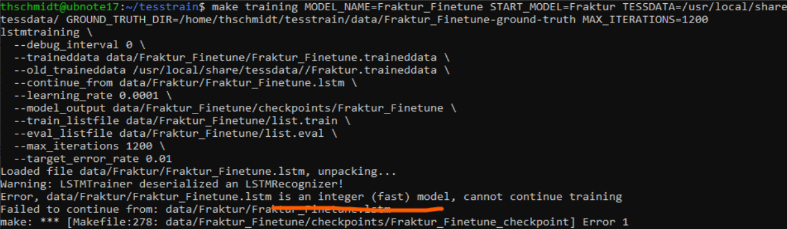

2. The path to the Tesseract model that is to be retrained must be known. Models located in the tessdata folder are usually retrained. The following command can be used to display all Tesseract models located in the tessdata folder:

```
tesseract --list-langs
```

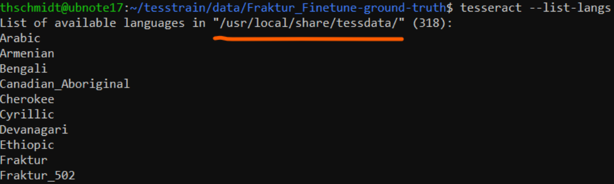

3. Tesseract models have the file extension `.traineddata`.

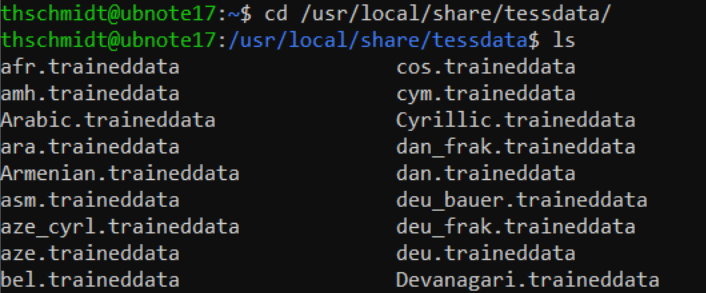

4. In the following example, the Tesseract model [Fraktur.traineddata](https://github.com/tesseract-ocr/tessdata/blob/4767ea922bcc460e70b87b1d303ebdfed0897da8/script/Fraktur.traineddata) is retrained with additional ground truth.

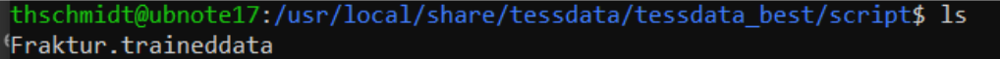

5. Firstly, the additional ground truth must be provided. To do this, switch to the tesstrain folder in the command line:

```
cd path/to/tesstrain-folder
```

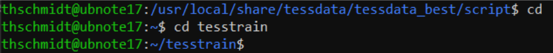

6. If not already present, a new folder with the name `data` must be created in the `tesstrain` folder:

```
mkdir data
```

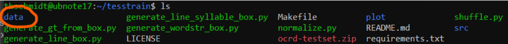

7. Create another folder in the `data` folder in which the ground truth used for the fine-tuning is stored. The file name of the folder must have the following structure (pay attention to *underscores and hyphens*!):

```
tesstrain/data/<MODEL_NAME>-ground-truth
```

Example:

```
mkdir data/Fracture_Finetune-ground-truth
```

Result:

```
tesstrain/data/Fracture_Finetune-ground-truth
```


8. Copy the ground truth to be used for fine-tuning into the newly created folder via Windows Explorer / MacOS Finder etc. Alternatively, the command line commands move (`mv`) or copy (`cp`) can be used:

```
cp -a path/to/GT-data/. path/to/GT-data-folder
```

Example:

```
cp -a ~/Example/Folder/Ground-Truth/Fracture_Finetune/. ~/tesstrain/data/Fraktur_Finetune-ground-truth
```

Result:
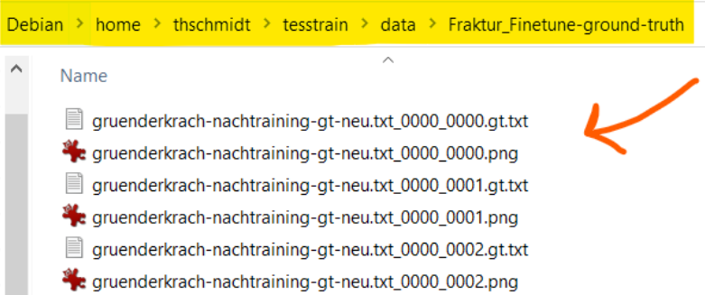

9. The fine-tuning workflow via tesstrain is triggered via the command line command `$ make training`. The command must be executed from the tesstrain directory.
10. The execution of the `$ make training` command requires the following basic structure and parameters:

```
make training MODEL_NAME=name_of_the_retrained_model START_MODEL=name_of_the_existing_base_model TESSDATA=path/to/tessdata/folder GROUND_TRUTH_DIR=path/to/GT_data MAX_ITERATIONS=number_of_training_repeats
```

Explanation of the parameters:

* `MODEL_NAME` = name of the new (retrained) model; can be freely assigned
* `START_MODEL` = name of the base model in the tessdata folder without the file extension `.traineddata` (e.g. `fracture` instead of `fracture.traineddata`)
* `TESSDATA` = path to the `tessdata` folder (or subfolder in the `tessdata` folder) in which the base model is located
* `GROUND_TRUTH_DIR` = path to the ground truth directory in the `tesstrain/data` folder
* `MAX_ITERATIONS` = number of repetitions of the training process; the number of repetitions can be freely selected. As a starting point and test, the existing ground truth should be multiplied by a factor of 10 (e.g. 120 ground truth image-line pairs \* 10 = 1200 iterations). As an alternative to `MAX_ITERATIONS`, the parameter `EPOCHS` can also be used; one epoch denotes a complete training run over all ground truth data (one epoch over 120 ground truth image-line pairs thus comprises 120 iterations; 10 epochs = 1200 iterations). Example: `EPOCHS = 10`

Example:

```
make training MODEL_NAME=Fraktur_Finetune START_MODEL=Fraktur TESSDATA=/usr/local/share/tessdata/tessdata_best/script GROUND_TRUTH_DIR=/home/thschmidt/tesstrain/data/Fraktur_Finetune-ground-truth MAX_ITERATIONS=1200
```

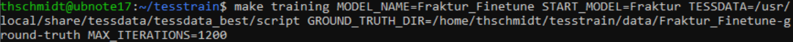

11. After confirming the `make training` command, `lstm` and `box` files are created in the Ground Truth folder for each image-text pair to be used for training:

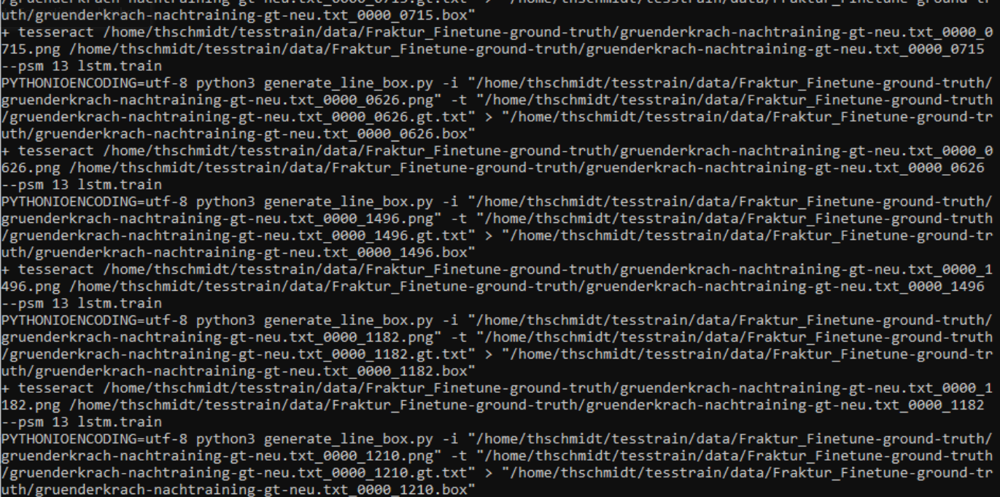

12. Once this step has been completed, the actual training process begins. By default, a message about the training progress is displayed in the command line after 100 iterations. A checkpoint is saved in `tessdata/data/MODEL_NAME/checkpoints` for larger training progresses.

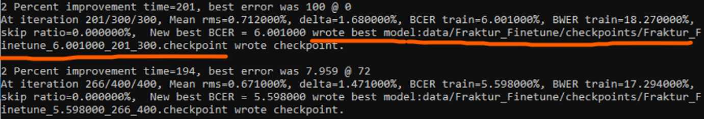 *Explanations of the data output can be found [here](https://tesseract-ocr.github.io/tessdoc/tess4/TrainingTesseract-4.00.html#iterations-and-checkpoints).*

13. After completion of the training, a further message is displayed showing the `minimum error rate` (`BCER`, Bag-of-Character Error Rate) of the last saved checkpoint.

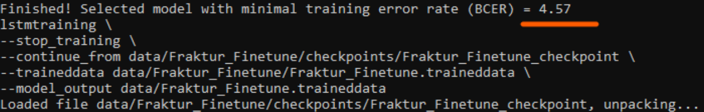

14. Finally, the saved checkpoints must be converted into `.traineddata` files. The command `make traineddata` is used for this. The command to convert all checkpoints:

```
make traineddata MODEL_NAME=<name of the retrained model>
```

Example:

```
make traineddata MODEL_NAME=Fracture_Finetune
```

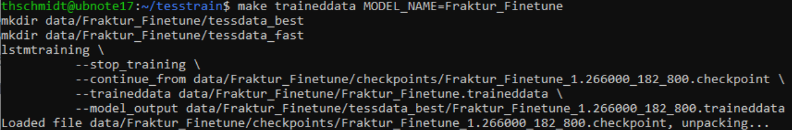

The command converts all checkpoints into `.traineddata` files and creates two further folders in the `tessdata/data/MODEL_NAME` folder: `tessdata_best` and `tessdata_fast`. These folders contain the checkpoints / models of the fine-tuning.

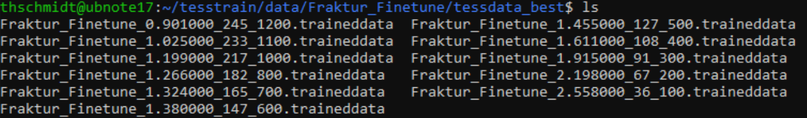

15. For the evaluation of the different checkpoints / models, it is recommended to create a corresponding folder in the `tessdata` directory and move (`mv`) or copy (`cp`) the models into this folder:

```
cp -a path/to/new_models/. path/to/tessdata-folder/
```

Example:

```
cp -a ~/tesstrain/data/Fraktur_Finetune/tessdata_fast/. /usr/local/share/tessdata/Fraktur_Finetune_EVAL
```

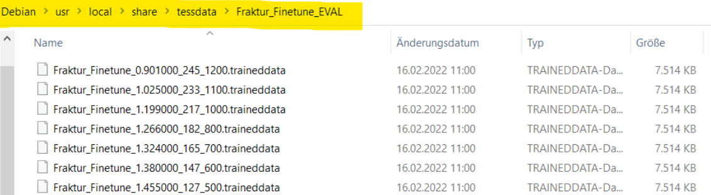

16. The command `tesseract --list-langs ` now also displays these models and can be used for text recognition via Tesseract:

```
tesseract --list-langs
```

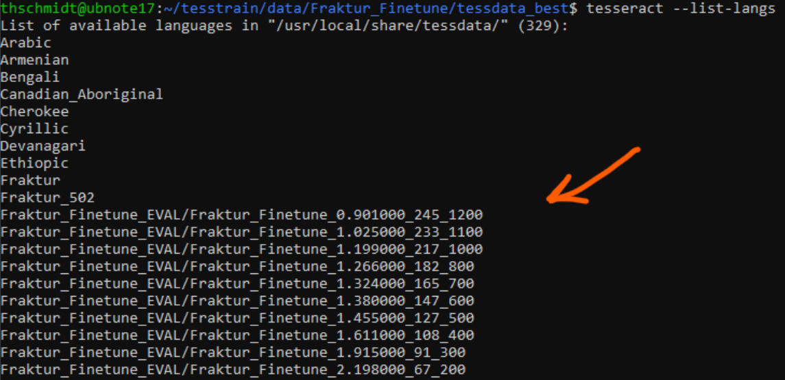

## 3. Evaluation of trained models

1. The following is an example of an evaluation of checkpoints / models fine-tuned with Tesseract and Tesstrain. The Python script `evaluate_models.py `, which can be found in the `Skripte` folder of this manual, is used for the evaluation.
2. Ground truth data that **has not** been used in the training process must be used for the evaluation. (e.g. real book pages on which the newly trained models are to be tested).

Example:

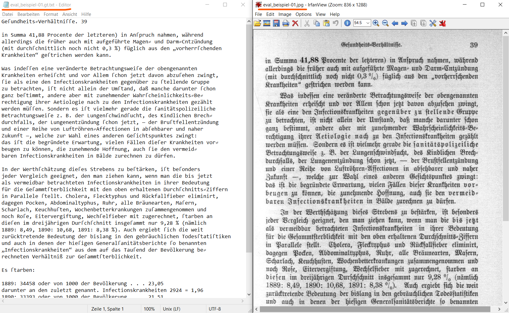

Notes:
* The image files must be in `PNG`, `JPG` or `TIF` format.
* The associated transcription must be available as a `TXT` file and have the file extension `.gt.txt`.
* The file names of the image and associated text file must be identical, except for the file extensions. Example: `eval_beispiel-01.png` and `eval_beispiel-01.gt.txt`

3. **Evaluation process**: The evaluation starts a text recognition with Tesseract for each ground truth image file (as in the example `eval_example-01.jpg`) provided for the evaluation purpose. The Tesseract models used for text recognition can be specified in advance (= fine-tuned models, as specified in section 2). The results of the text recognition with these models are then compared with the text ground truth (as in the example `eval_example-01.gt.txt`) of the corresponding image. (See section 3.3.)

### 3.1 Setup for evaluation
1. Create a new folder for the evaluation. The evaluations of the models are saved in this folder. The name of the folder can be freely assigned; for our example we use the folder name `evaluation`:

```
mkdir evaluation
```

2. The files `evaluate_models.py` and `requirements.txt` from the scripts folder of these instructions must be copied into this folder.

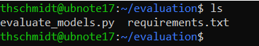

3. Installation of the Python script:

```
python3 -m venv venv
source venv/bin/activate
pip install -r requirements.txt
```

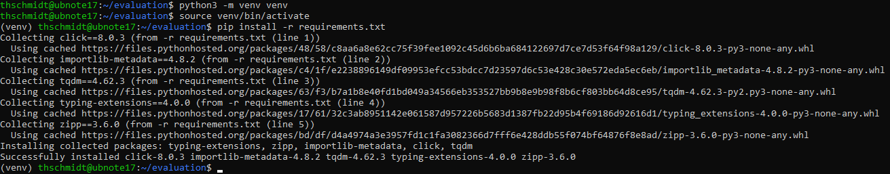

4. Before each use of the evaluation script `evaluate_models.py`, the virtual Python environment must be started, which was created above with the command `python3 -m venv venv`. To do this, change to the `evaluation` folder and execute the command `source venv/bin/activate`:

```
cd evaluation
source venv/bin/activate
```

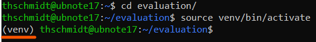

Note: The term `venv` should now appear in front of the user name, indicating that the virtual Python environment has been activated and the evaluation script can be executed.

5. In addition, the evaluations are based on the evaluation reports from ocreval. A step-by-step installation guide for the programme can be found at <https://github.com/eddieantonio/ocreval>.

### 3.2 Providing the ground truth data for the evaluation
1. Create another folder for the ground truth in the 'evaluation' folder. This folder name can also be freely assigned. For our example, we use `eval-data` and copy the ground truth to be used for the evaluation into this folder:

```
cd evaluation
mkdir eval-data
cp -a ~/path/to/ground-truth/for/evaluation/. ~/evaluation/eval-data
```

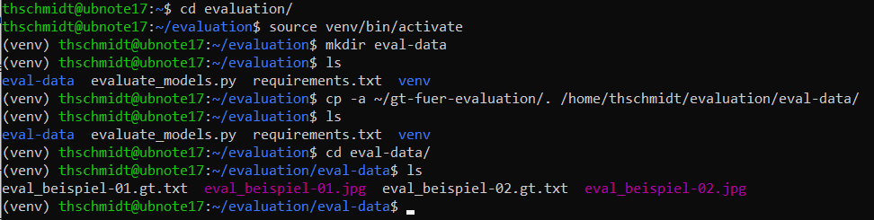

### 3.3 Performing the evaluation

1. To start the evaluation, the Python script `evaluate_models.py` is executed and the path to the ground truth to be used for the evaluation is specified. The script starts a text recognition with Tesseract via the provided ground truth in the `eval-data` folder and uses the specified Tesseract models for this.

Example:

```
python3 evaluate_models.py -m 'Fraktur_Finetune_EVAL*' -j 60% -r /home/thschmidt/evaluation/eval-data
```

Explanation:

* `python3 evaluate_models.py` = starts the Python script
* `-m 'Fracture_Finetune_EVAL*'` = specifies the folder in the `tessdata` folder in which the Tesseract checkpoints / models that were trained under point 2.2 are stored. The truncation `*` indicates that all models stored in the `Fracture_Finetune_EVAL` folder are to be evaluated
* `-j 60%` = parallelises the evaluation to speed up the evaluation and in this case uses 60% of the available processor cores
* `-r` = specifies that all ground truth data existing in the `eval-data` folder should be evaluated
* `/home/thschmidt/evaluation/eval-data` = path to the folder in which the ground truth provided for the evaluation is stored.

*Note*: the command `python3 evaluate_models.py --help` can be used to display help in the command line, which shows all available parameters of the evaluation script.

2. After starting the Python script, the evaluation is initiated, which can take several minutes depending on the scope of the ground truth used for the evaluation. The progress of the evaluation and the Tesseract models participating in the evaluation are displayed in the command line.

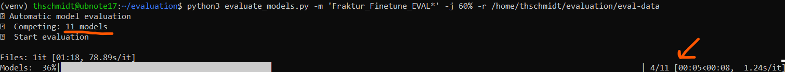

3. Once the evaluation is complete, the ranking of the models is displayed in the command line.

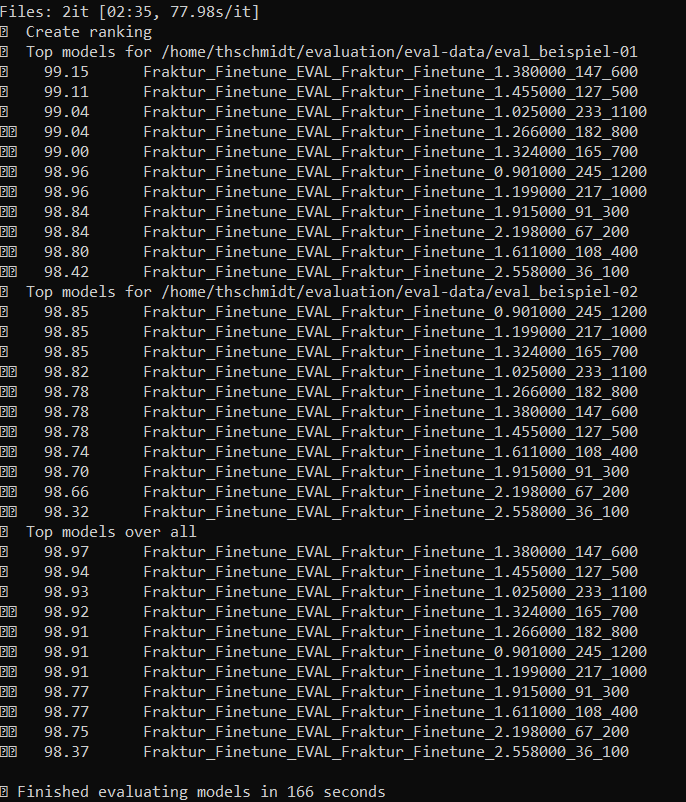

Explanation:

* The ranking indicates the error rate of all models separately according to the ground truth data used in the evaluation.
* The first block shows the result for the ground truth pair `eval_example-01`, the second block shows the result for the ground truth pair `eval_example-02`, the third and last block (`Top models over all`) shows the average best models.
* The numbers in front of each model indicate the drawing recognition rate of the model. `99.15` means that the model `Fracture_Finetune_1.380000_147_600` in the `tessdata` folder `Fracture_Finetune_EVAL` for the provided ground truth file `eval_example-01.jpg` achieves a character recognition rate of 99.15 %, i.e. generates a character error rate (CER) of 0.85 %.
* For each image file used in the evaluation, a subfolder was created in the `evaluation/eval-data/` folder, in which the OCR results of the models to be evaluated are stored.

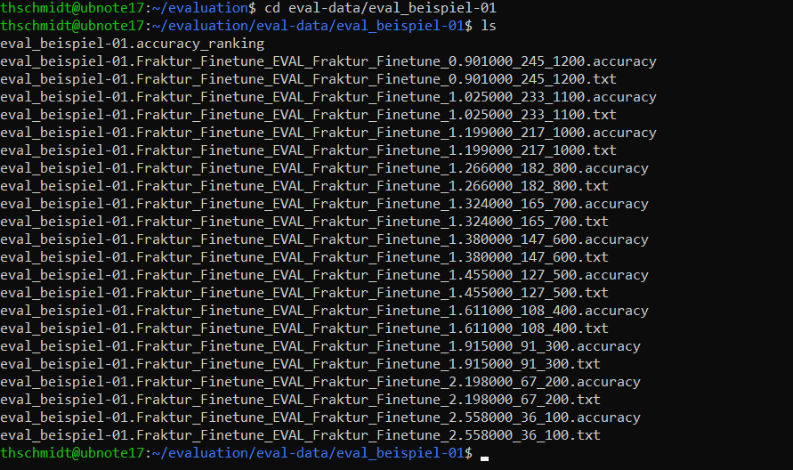

* The OCR results are available in 'TXT' format and are labelled with the model names that took part in the evaluation.

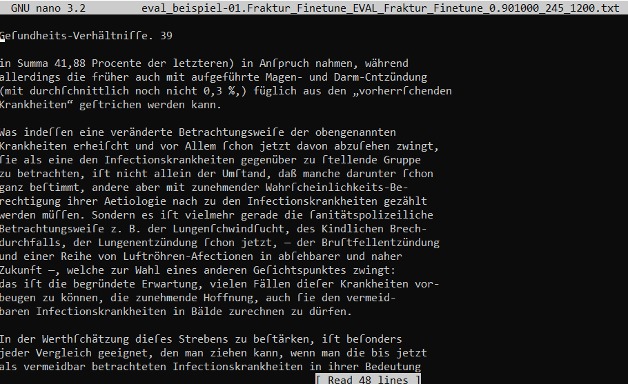
