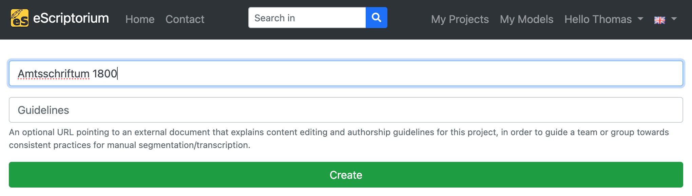

# Training with eScriptorium (*step-by-step guide*)

*eScriptorium is a platform for manual or automated segmentation and text recognition of historical manuscripts and prints* [[Wikipedia](https://de.wikipedia.org/wiki/EScriptorium)]. In addition, the platform enables user-friendly training and (work-specific) fine-tuning of own layout segmentation and text recognition models directly in the browser. eScriptorium is open-source and free of charge. The trained models can be downloaded and used without restrictions.

The following step-by-step guide provides an introduction to the use of eScriptorium for training own OCR or HTR models.

# Table of Contents

1. [How does training work?](1.-How-does-training-work?)

## 1. How does training work?

For all automated layout segmentation and text recognition tasks, eScriptorium uses the open-source OCR/HTR engine [Kraken](https://kraken.re/main/index.html). The models used for layout segmentation and text recognition can be trained directly in eScriptorium with just a few clicks. Both completely new models can be trained (*training from scratch*) and existing models can be fine-tuned (*fine-tuning*) for specific use cases or domains. The training of OCR models is often carried out via the command line and requires appropriate knowledge. Since eScriptorium provides a graphical user interface, users without command line knowledge can also carry out trainings. 

It is necessary to understand the area of application of the two training variants mentioned: 

- **`Training from scratch`**: The training of a completely new model (that is not based on an already existing model) is called *training from scratch*. So-called *ground truth* is used for training, e.g. images of book pages with corresponding transcriptions that capture the text content of the pages. In order to generate robust OCR models with a training from scratch, a large amount of data is usually required (sometimes several hundred thousand lines of text). This amount can lead to problems with eScriptorium. For example, an eScriptorium project that is to be used for training from scratch with several thousand digitised documents and transcriptions can reach memory and usability limits. In such cases, training from scratch outside of eScriptorium via command line is recommended.
  
- **`Fine-tuning`**: Fine-tuning, or work-specific fine-tuning, involves taking an existing model and specifically adapting it to a new use case or domain (*work-specific* in this context means that the fine-tuning is undertaken with a specific work (e.g. a historical document, manuscript or book) or group of similar works in mind). For example, a basic OCR model trained to recognize standard alphanumeric Latin characters can be unable to identify currency symbols like the Euro (€), Pound (£), or Yen (¥). To fine-tune this model for a financial domain, additional training is done using a dataset that includes these specific currency symbols. This process adjusts the model's parameters to become more sensitive to these new symbols, enabling it to accurately recognize and interpret them in financial documents where they frequently appear.

## 2. How to train in eScriptorium
### 2.1. Provide or create training data (ground truth)
In order to `train from scratch` or to `fine-tune` an existing model you must provide training data (= *ground truth*). In eScriptorium this training data is provided inside a project. Training data consists of **images** (digitised pages of books, manuscripts, documents etc.) and corresponding **transcriptions**. The transcriptions attempt to capture the text content of the images as accurately as possible. If you don't have any ground truth to train with you can create it inside eScriptorium (i.e. create transcriptions for images you upload to an eScriptorium project). 

Here is an example in eScriptorium:

### 2.2. Where to find models 
Especially for fine-tuning already existing layout segmentation or text recognition models are needed. Here is a list of places where `kraken` models (the OCR/HTR engine eScriptorium uses in the background) can be found:

- **Zenodo**: [zenodo.org/communities/ocr_models](https://zenodo.org/communities/ocr_models)

All downloaded models can be uploaded to eScriptorium by clicking on **"My Models"** on the upper right corner of the screen. Click on **"Upload a model"** in the next screen an choose the model you want to upload.

## 3. How to fine-tune a model
In many cases, `fine-tuning` can be a time- and resource-saving method for improving an existing layout segmentation or text recognition model for a new use case. To perform fine-tuning, an existing (layout segmentation or text recognition) model is required.

To fine-tune a model in eScriptorium, we recommend the following workflow:

1. Upload the images to be used for training
2. Test the automatic layout segmentation and text recognition for the uploaded images and evaluate the results
3. Improve the transcriptions that were automatically generated in step 2
4. Fine-tune the model used in step 2 with the ground truth created in step 3
5. Evaluate the results and repeat steps 3 and 4 if necessary

The following steps describe this workflow in detail.

### Step 1: Create a new project and document
Start with creating a new eScriptorium project by browsing to the eScriptorium start page and clicking on **"My Projects"** in the upper right corner of the screen.

Next, click on the green **"Create new Project"** button.

Name your project on the next screen and click on **"Create"**.

Once the project has been created, the project overview is displayed. The project you have just created should be displayed here. Click on it.

Create a new document inside your project by clicking on the green **"Create new Document"** button.

On the next screen, give the document a name and click on **"Create"** (or **"Update"**). A message should appear in the upper right corner that the document has been created successfully.

### Step 2: Import your images

Switch to the **"Images"** tab and upload your images either by clicking into the **"Drop images here or click to upload"** section or by clicking the **"Import"** button.

Here a the difference of both options:
- `Drop images here or click to upload`: Upload images from your hard drive in different file formats (`PNG`, `JPG`, `TIFF` etc.)
- `Import` button: Upload images via `IIIF` or as `PDF` documents.

As soon as all images have been uploaded, they will appear as a preview at the bottom of the screen.

### Step 3: Test run layout segmentation and text-recognition on your data

Wo liegen die Modelle (> Zenodo)

### Step 4: Search for an existing model that works (somewhat)
### Step 5: Create ground truth
### Step 6: Train
### Step 7: Test and evaluate
### Step 8: Iterate
